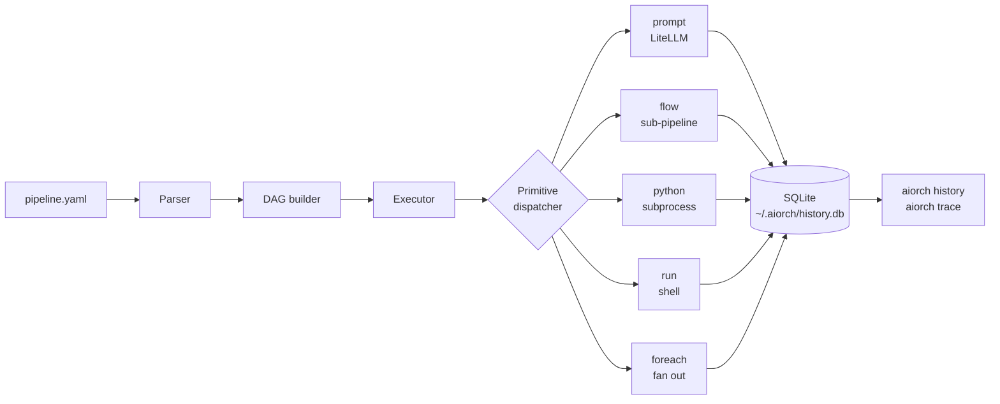
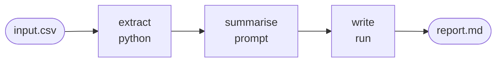

<p align="center">
  
</p>

<h1 align="center">aiorch</h1>

<p align="center">
  <strong>YAML-driven pipelines for LLMs, Python, and shell — runnable from the command line.</strong>
</p>

<p align="center">
  <a href="https://www.python.org/"></a>
  <a href="LICENSE"></a>
  <a href="#roadmap"></a>
</p>

---

aiorch turns a YAML file into a runnable pipeline. Declare your steps — LLM prompts, Python snippets, shell commands — and `aiorch run` executes the DAG. No server, no scheduler, no database setup.

```bash
pip install aiorch
export OPENROUTER_API_KEY=sk-or-v1-...
aiorch run examples/llm/01-hello-llm.yaml
```

Works with any provider [LiteLLM](https://docs.litellm.ai/) supports — OpenAI, Anthropic, Gemini, OpenRouter, Ollama, Bedrock, and more.

---

## How it works

aiorch turns a YAML file into an executable DAG. The full lifecycle of `aiorch run`:



1. **Parse** — `aiorch.core.parser` reads your YAML into a typed pipeline object (steps, inputs, dependencies).
2. **DAG build** — `aiorch.core.dag` resolves `depends:` and `foreach:` into a layered DAG. Independent steps land on the same layer so they run in parallel.
3. **Execute** — the runtime walks the DAG layer by layer. Each step is dispatched to its primitive handler.
4. **Primitives:**
   - `prompt` — LLM calls via LiteLLM, response-cached by hash of `(prompt, model, temperature, max_tokens)`.
   - `python` — a Python body runs in an isolated subprocess with `inputs` and `result` bindings.
   - `run` — shell command via `subprocess`, Jinja-resolved against the context.
   - `flow` — invoke another pipeline as a single step.
   - `foreach` — per-item fan-out with optional `parallel: true`.
   - `condition` — branch on a boolean expression.
5. **Persist** — every run and step is logged to SQLite. LLM responses are cached so re-running a step with identical inputs is free.
6. **Replay** — `aiorch history` / `aiorch trace <run-id>` reads back exactly what happened.

### A pipeline is a DAG, not a script

Three steps — extract data, summarise with an LLM, write to disk:



```yaml
steps:
  extract:
    python: |
      import csv
      rows = list(csv.DictReader(open(inputs["file"])))
      result = [r["comment"] for r in rows]

  summarise:
    prompt: |
      Summarise these customer comments in 3 bullets:
      - {{c}}
      
    depends: [extract]

  write:
    run: cat > report.md <<EOF
{{summarise}}
EOF
    depends: [summarise]
```

Each step declares what it needs (`depends:`) and what it produces (implicit via its name). aiorch figures out the order, the parallelism, and the retries.

---

## Features

- **LLM primitives** — prompt, schema-validated extraction, classify-and-branch, multi-model comparison.
- **DAG shapes** — chain, parallel + merge, foreach, diamond, conditional routing.
- **LLM + Python hybrid** — the LLM for reasoning, deterministic Python for side effects.
- **Sub-pipeline composition** — one pipeline invokes another via `flow:`.
- **Cost tracking** — prompt / completion tokens and USD per provider per run, persisted to `~/.aiorch/history.db`.
- **Dry-run + validation** — catch schema errors and unresolved templates before spending tokens.

> **Not in the CLI:** real production connectors (Postgres / S3 / Kafka / SMTP / webhook), the `agent:` primitive with function-calling + MCP tools, artifact storage, multi-tenant workspaces, scheduling, and Prometheus metrics. Those live in the commercial aiorch Platform — see §[The commercial platform](#the-commercial-platform).

---

## Quick start setup

### 1. Install

```bash
pip install aiorch                   # CLI — LLM / Python / shell primitives
pip install 'aiorch[validation]'     # + jsonschema input validation
```

Requires **Python 3.11+**.

### 2. Configure a provider

aiorch works with any model LiteLLM supports. Export the key for whichever provider you're using:

```bash
export OPENROUTER_API_KEY=sk-or-v1-...     # OpenRouter (multi-provider, recommended)
export OPENAI_API_KEY=sk-...                # direct OpenAI
export ANTHROPIC_API_KEY=sk-ant-...         # direct Anthropic
export GOOGLE_API_KEY=...                   # direct Google AI
```

Optionally, drop an `aiorch.yaml` alongside your pipelines to pin the provider, model, and storage backend:

```yaml
# aiorch.yaml
llm:
  api_key: ${OPENROUTER_API_KEY}
  api_base: https://openrouter.ai/api/v1
  model: google/gemini-2.5-flash

storage:
  type: sqlite        # default — ~/.aiorch/history.db
```

Without `aiorch.yaml`, aiorch falls back to standard env vars (`OPENAI_API_KEY`, `ANTHROPIC_API_KEY`, `OPENROUTER_API_KEY`, etc.) and a sensible default model. aiorch auto-discovers `aiorch.yaml` by walking up from the current directory, so `cd` into the folder holding it before running.

### 3. Write a pipeline

```yaml
# hello.yaml
name: hello
steps:
  answer:
    prompt: |
      In one sentence, what is aiorch?
    output: summary

  show:
    run: echo "{{summary}}"
    depends: [answer]
```

### 4. Run it

```bash
$ aiorch run hello.yaml
[answer]  aiorch runs declarative YAML pipelines...
[show]    aiorch runs declarative YAML pipelines...
```

Override inputs at runtime with `-i KEY=VALUE` (scalars), `-i KEY=@./path` (files), or `--input file.json` (bulk):

```bash
$ aiorch run examples/llm/20-csv-to-markdown-report.yaml \
    -i data=@./examples/llm/inputs/sample-projects.csv
```

### 5. Inspect the run

```bash
aiorch history                 # list recent runs
aiorch trace <run-id>          # step-by-step timeline for one run
aiorch run hello.yaml --dry    # show plan without executing (skips LLM calls)
aiorch run hello.yaml -v       # verbose — print each step's input and output
```

Every run is persisted to `~/.aiorch/history.db`. LLM responses are cached by hash of `(prompt, model, temperature, max_tokens)` — re-running a step with identical inputs hits the cache and costs nothing.

---

## CLI reference

| Command | Purpose |
|---|---|
| `aiorch run <file>` | Execute a pipeline |
| `aiorch validate <file>` | Schema + template lint, no execution |
| `aiorch list <file>` | List all steps in a pipeline |
| `aiorch visualize <file>` | ASCII DAG diagram |
| `aiorch plan <file>` | DAG layers + cost estimate |
| `aiorch init <template>` | Scaffold a new pipeline from a template |
| `aiorch history` | List recent runs and their status |
| `aiorch history <run-id>` | Show details of one run |
| `aiorch trace <run-id>` | Step-by-step trace for one run |

Run `aiorch --help` for the full list of flags.

---

## Examples

**72 runnable pipelines** shipped under [`examples/`](examples), organized into two tracks:

| Directory | Count | What's inside |
|---|---|---|
| [`examples/llm/`](examples/llm) | 30 | LLM pipelines — prompts, extraction, chains, fan-out, hybrid LLM + Python |
| [`examples/core/`](examples/core) | 42 | Zero-LLM pipelines — every primitive, every DAG shape, input types, developer utilities |

Each track has its own walkthrough:

- [`examples/README.md`](examples/README.md) — **start here** for the full guide on secrets, model selection, and passing inputs.
- [`examples/llm/README.md`](examples/llm/README.md) — LLM pipelines by tier (basic → DAG shapes → hybrid → developer workflows).
- [`examples/core/README.md`](examples/core/README.md) — core pipelines by group (primitives → DAG shapes → DB access → production patterns → utilities).

```bash
# Core pipelines — no API key required
aiorch run examples/core/01-smoke-test.yaml

# LLM pipelines — provider config lives at examples/llm/aiorch.yaml
export OPENROUTER_API_KEY=sk-or-v1-...
cd examples/llm && aiorch run 01-hello-llm.yaml
```

---

## Roadmap

This is **v0.1 alpha** — YAML schema and CLI flags may change. Pin an exact version in CI.

Planned:

- Additional LLM primitives (structured output schemas, streaming sinks).
- Richer `flow:` composition (parameter forwarding, outputs passthrough).
- First-class Windows support.

---

## Contributing

Issues and pull requests welcome at [github.com/ereshzealous/aiorch-cli](https://github.com/ereshzealous/aiorch-cli).

---

## The commercial platform

Everything above is the OSS CLI — LLM orchestration, YAML DAG, local SQLite history. For team-scale work you'll want the commercial **aiorch Platform**, which adds:

- **Production connectors** — Postgres, S3 / MinIO / R2 / GCS, Kafka, SMTP, webhook — with workspace-scoped secrets and audit logs.
- **`agent:` primitive with MCP** — function-calling agents over stdio + Streamable HTTP, plus a session-pooled MCP registry for cross-replica agent orchestration.
- **Artifact store** — content-addressed file storage (local disk or S3-compatible) with dedup, quotas, and UI download.
- **Multi-tenant workspaces + RBAC** — orgs, workspaces, roles (viewer / operator / editor / admin / owner), API keys, invitations.
- **Scheduler + webhook triggers** — cron, HMAC-verified webhooks, per-trigger rate limits, delivery history.
- **Executor fleet** — distributed, admission-controlled, Redis-coordinated run execution with per-workspace concurrency caps.
- **Web UI** — full-featured dashboard, pipeline editor, trace viewer, cost analytics, health page, and coordination observability.
- **Prometheus metrics + /api/health** — production observability for every runtime surface.
- **Postgres storage** — run history, audit trail, and query-able run metadata across a team.

[Contact](mailto:eresh.zealous@gmail.com) if that's you.

---

## License

Apache 2.0 — see [`LICENSE`](LICENSE).
