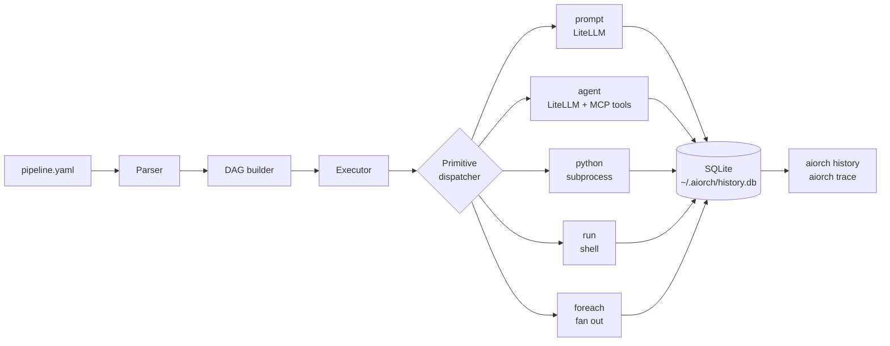

<p align="center">
  
</p>

<h1 align="center">aiorch</h1>

<p align="center">
  <strong>YAML-driven pipelines for LLMs, Python, and shell — runnable from the command line.</strong>
</p>

<p align="center">
  <a href="https://www.python.org/"></a>
  <a href="LICENSE"></a>
  <a href="#roadmap"></a>
</p>

---

aiorch turns a YAML file into a runnable pipeline. Declare your steps — LLM prompts, Python snippets, shell commands, MCP tool calls — and `aiorch run` executes the DAG. No server, no scheduler, no database setup.

```bash
pip install aiorch
export OPENROUTER_API_KEY=sk-or-v1-...
aiorch run examples/llm/01-hello-llm.yaml
```

Works with any provider [LiteLLM](https://docs.litellm.ai/) supports — OpenAI, Anthropic, Gemini, OpenRouter, Ollama, Bedrock, and more.

---

## How it works

aiorch turns a YAML file into an executable DAG. The full lifecycle of `aiorch run`:



1. **Parse** — `aiorch.core.parser` reads your YAML into a typed pipeline object (steps, inputs, dependencies).
2. **DAG build** — `aiorch.core.dag` resolves `depends:` and `foreach:` into a layered DAG. Independent steps land on the same layer so they run in parallel.
3. **Execute** — the runtime walks the DAG layer by layer. Each step is dispatched to its primitive handler.
4. **Primitives:**
   - `prompt` / `agent` — LLM calls via LiteLLM, response-cached by hash of `(prompt, model, temperature, max_tokens)`.
   - `python` — a Python body runs in an isolated subprocess with `inputs` and `result` bindings.
   - `run` — shell command via `subprocess`, Jinja-resolved against the context.
   - `foreach` — per-item fan-out with optional `parallel: true`.
5. **Persist** — every run and step is logged to SQLite. LLM responses are cached so re-running a step with identical inputs is free.
6. **Replay** — `aiorch history` / `aiorch trace <run-id>` reads back exactly what happened.

### A pipeline is a DAG, not a script

Three steps — extract data, summarise with an LLM, write to disk:


```yaml
steps:
  extract:
    python: |
      import csv
      rows = list(csv.DictReader(open(inputs["file"])))
      result = [r["comment"] for r in rows]

  summarise:
    prompt: |
      Summarise these customer comments in 3 bullets:
      - {{c}}
      
    depends: [extract]

  write:
    run: cat > report.md <<EOF
{{summarise}}
EOF
    depends: [summarise]
```

Each step declares what it needs (`depends:`) and what it produces (implicit via its name). aiorch figures out the order, the parallelism, and the retries.

---

## Features

- **LLM primitives** — prompt, schema-validated extraction, classify-and-branch, multi-model comparison.
- **DAG shapes** — chain, parallel + merge, foreach, diamond, conditional routing.
- **LLM + Python hybrid** — the LLM for reasoning, deterministic Python for side effects.
- **Agents + MCP** — function-calling LLMs with MCP tools over stdio or Streamable HTTP.
- **Real connectors** — Postgres, S3, Kafka, SMTP, webhooks (via `aiorch[connectors]`).
- **Cost tracking** — prompt / completion tokens and USD per provider per run, persisted to `~/.aiorch/history.db`.
- **Dry-run + validation** — catch schema errors and unresolved templates before spending tokens.

---

## Quick start

```yaml
# hello.yaml
name: hello
steps:
  answer:
    prompt: |
      In one sentence, what is aiorch?
    output: summary

  show:
    run: echo "{{summary}}"
    depends: [answer]
```

```bash
$ aiorch run hello.yaml
[answer]  aiorch runs declarative YAML pipelines...
[show]    aiorch runs declarative YAML pipelines...
```

Override inputs at runtime:

```bash
$ aiorch run examples/llm/20-csv-to-markdown-report.yaml \
    -i data=@./examples/llm/inputs/sample-projects.csv
```

---

## Installation

```bash
pip install aiorch                    # core CLI
pip install 'aiorch[connectors]'      # + Postgres / S3 / Kafka / SMTP
pip install 'aiorch[metrics]'         # + Prometheus export (opt-in)
pip install 'aiorch[validation]'      # + jsonschema input validation
```

Requires **Python 3.11+**.

---

## Configuration

aiorch looks for `aiorch.yaml` in the current directory.

```yaml
llm:
  api_key: ${OPENROUTER_API_KEY}
  model: google/gemini-2.5-flash
  api_base: https://openrouter.ai/api/v1

storage:
  type: sqlite        # default — ~/.aiorch/history.db
```

No `aiorch.yaml`? aiorch falls back to standard environment variables (`OPENAI_API_KEY`, `ANTHROPIC_API_KEY`, `OPENROUTER_API_KEY`, etc.) and a sensible default model.

---

## CLI reference

| Command | Purpose |
|---|---|
| `aiorch run <file>` | Execute a pipeline |
| `aiorch validate <file>` | Schema + template lint, no execution |
| `aiorch list <file>` | List all steps in a pipeline |
| `aiorch visualize <file>` | ASCII DAG diagram |
| `aiorch plan <file>` | DAG layers + cost estimate |
| `aiorch init <template>` | Scaffold a new pipeline from a template |
| `aiorch history` | List recent runs and their status |
| `aiorch history <run-id>` | Show details of one run |
| `aiorch trace <run-id>` | Step-by-step trace for one run |

Run `aiorch --help` for the full list of flags.

---

## MCP support

aiorch ships a built-in MCP client — both **stdio** (subprocess) and **Streamable HTTP** (MCP 2025 spec). Attach tools to any `agent:` step:

```yaml
steps:
  analyze:
    agent:
      model: gpt-4o-mini
      tools:
        mcp:
          - server: "npx -y @modelcontextprotocol/server-filesystem"
            args: ["/tmp"]
      prompt: "List files under /tmp and summarize"
```

---

## Examples

**72 runnable pipelines** shipped under [`examples/`](examples), organized into two tracks:

| Directory | Count | What's inside |
|---|---|---|
| [`examples/llm/`](examples/llm) | 30 | LLM pipelines — prompts, extraction, chains, fan-out, agents, hybrid LLM + Python |
| [`examples/core/`](examples/core) | 42 | Zero-LLM pipelines — every primitive, every DAG shape, input types, DB access, developer utilities |

Each track has its own walkthrough:

- [`examples/README.md`](examples/README.md) — **start here** for the full guide on secrets, model selection, and passing inputs.
- [`examples/llm/README.md`](examples/llm/README.md) — LLM pipelines by tier (basic → DAG shapes → hybrid → developer workflows).
- [`examples/core/README.md`](examples/core/README.md) — core pipelines by group (primitives → DAG shapes → DB access → production patterns → utilities).

```bash
# Core pipelines — no API key required
aiorch run examples/core/01-smoke-test.yaml

# LLM pipelines — provider config lives at examples/llm/aiorch.yaml
export OPENROUTER_API_KEY=sk-or-v1-...
cd examples/llm && aiorch run 01-hello-llm.yaml
```

---

## Roadmap

This is **v0.1 alpha** — YAML schema and CLI flags may change. Pin an exact version in CI.

Planned:

- Additional LLM primitives (structured output schemas, streaming sinks).
- Broader connector catalog.
- Pipeline composition (one pipeline imports another).
- First-class Windows support.

---

## Contributing

Issues and pull requests welcome at [github.com/ereshzealous/aiorch-cli](https://github.com/ereshzealous/aiorch-cli).

---

## License

Apache 2.0 — see [`LICENSE`](LICENSE).
