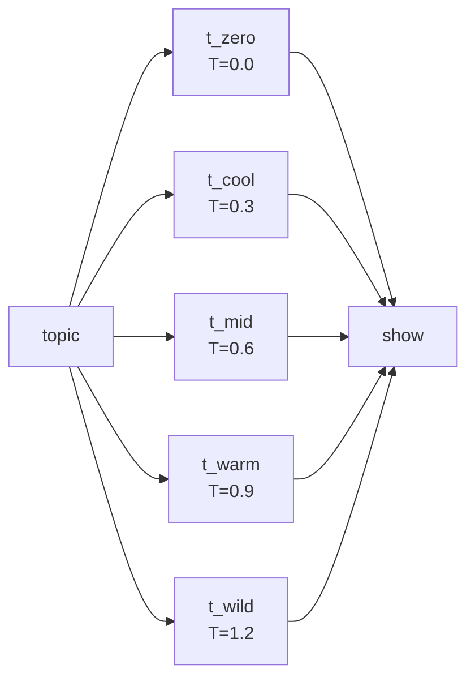
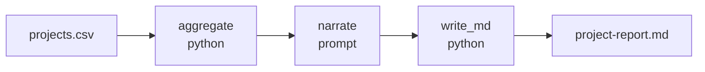
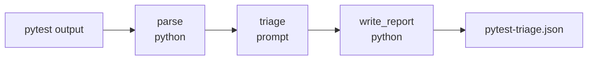
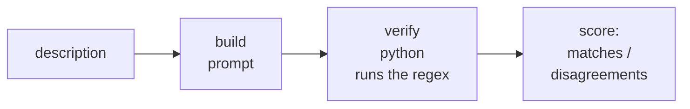

# aiorch CLI — LLM pipeline catalog

15 example pipelines that exercise aiorch's LLM primitive end-to-end from the command line. No Platform mode, no MinIO, no Postgres — everything runs locally against whatever LLM provider you've configured, with run history and response cache stored in SQLite at `~/.aiorch/history.db`.

## Prerequisites

1. **aiorch CLI installed** — `aiorch --version` should return ≥ 0.4.1.
2. **An LLM provider API key exported to the shell.** The `aiorch.yaml` in this folder is pre-wired for **OpenRouter**, which routes to 100+ models under one key. Swap to your provider of choice by editing two lines.

```bash
# OpenRouter (default in the shipped aiorch.yaml):
export OPENROUTER_API_KEY=sk-or-v1-...

# Or, if you switch aiorch.yaml to a different provider:
export OPENAI_API_KEY=sk-...
export ANTHROPIC_API_KEY=sk-ant-...
export GOOGLE_API_KEY=...
```

3. **Run from this directory** so aiorch picks up `./aiorch.yaml`:

```bash
cd aiorch-cli/examples/llm
aiorch run 01-hello-llm.yaml
```

## How LLM provider config works

aiorch CLI walks up from the current directory looking for `aiorch.yaml` / `aiorch.yml` / `.aiorch.yaml`. This folder ships one pre-configured. Contents:

```yaml
llm:
  model: google/gemini-2.5-flash        # any litellm-supported string
  api_key: ${OPENROUTER_API_KEY}        # read from env, never hardcoded
  base_url: https://openrouter.ai/api/v1   # optional; set when routing through OpenRouter
```

That's the whole LLM config. No `provider:` field needed — it's inferred from the model string and the `base_url`. To swap providers, edit only these three lines. Per-pipeline / per-step overrides go in the pipeline YAML via `model:` / `temperature:` / `max_tokens:` on the step itself.

## Structure

```
cli_llm/
├── README.md                     ← this file
├── aiorch.yaml                   ← LLM provider + SQLite storage
├── 01-hello-llm.yaml             ← start here
├── ...
├── 15-changelog-drafter.yaml
└── inputs/
    ├── sample-prose.txt          ← for 02
    ├── headlines.json            ← for 07
    ├── sample-feedback.csv       ← for 09, 14
    ├── long-article.txt          ← for 11
    ├── sample-prs.json           ← for 12
    ├── sample-errors.log         ← for 13
    └── sample-commits.txt        ← for 15
```

---

## The 15 pipelines

### Tier 1 — Basic LLM primitives (01-04)

Start here. Each is 1-3 steps, no external data, runs in one second.

#### `01-hello-llm.yaml` — simplest possible LLM pipeline

No input, one prompt, one echo. First test of "is my provider wired?"

```bash
aiorch run 01-hello-llm.yaml
```

#### `02-summarize-text.yaml` — file input → LLM summary

Reads a text file from disk, asks the LLM for a 3-bullet summary.

```bash
aiorch run 02-summarize-text.yaml -i document=@./inputs/sample-prose.txt
```

#### `03-structured-extract.yaml` — JSON-schema-validated extraction

Extract people / organizations / dates / amounts from free text. `retry_on_invalid: 2` automatically asks the LLM to correct its output if it doesn't match the schema.

```bash
aiorch run 03-structured-extract.yaml
aiorch run 03-structured-extract.yaml -i text="Dana met Rohan in Tokyo on 2026-02-14 about a \$500K seed round."
```

#### `04-multi-model-compare.yaml` — same prompt, two models side-by-side

Compare a fast/cheap model vs a larger one. Edit the two `model:` lines to any pair your provider serves.

```bash
aiorch run 04-multi-model-compare.yaml
```

### Tier 2 — DAG shapes with LLM steps (05-08)

Every shape aiorch supports, demonstrated with LLM primitives.

#### `05-chain-refine.yaml` — chain of two LLM calls

Step 1 drafts, step 2 refines. Output of the first feeds the prompt of the second via Jinja interpolation.

```bash
aiorch run 05-chain-refine.yaml
aiorch run 05-chain-refine.yaml -i topic="onboarding docs for a new backend hire"
```

#### `06-parallel-perspectives.yaml` — fan-out + fan-in

Three parallel LLM calls each take a different perspective, a fourth synthesizes into a balanced recommendation. All three perspective calls run concurrently.

```bash
aiorch run 06-parallel-perspectives.yaml -i topic="mandatory code reviews"
```

#### `07-foreach-tagger.yaml` — foreach + LLM per item

One LLM call per list element, running in parallel.

```bash
aiorch run 07-foreach-tagger.yaml --input ./inputs/headlines.json
```

#### `08-classify-then-branch.yaml` — conditional routing

First LLM step classifies the input, then exactly one downstream branch runs based on that class. Skipped branches appear as SKIPPED (not failed) in the trace.

```bash
aiorch run 08-classify-then-branch.yaml
aiorch run 08-classify-then-branch.yaml -i message="The new dashboard looks great!"
```

### Tier 3 — Hybrid LLM + Python (09-11)

Where aiorch's "declarative DAG + tactical Python bodies" model pays off. LLM for semantic work, Python for deterministic work, both in the same pipeline.

#### `09-sentiment-scoring.yaml` — CSV → LLM per row → Python aggregation

Python extracts comments from a CSV, LLM classifies sentiment per row (parallel), Python aggregates into a positive / neutral / negative rollup with sample quotes.

```bash
aiorch run 09-sentiment-scoring.yaml -i feedback=@./inputs/sample-feedback.csv
```

#### `10-extract-then-validate.yaml` — LLM extract → Python validate

LLM extracts structured records, Python validates against domain rules the JSON schema can't express (age 0-120, valid email regex, date not in future or before 1950). Flags bad rows for human review.

```bash
aiorch run 10-extract-then-validate.yaml
```

#### `11-map-reduce-summarize.yaml` — split → parallel LLM map → LLM reduce

For documents larger than one LLM context window. Python chunks the text on paragraph boundaries, parallel foreach summarizes each chunk, a final LLM call reduces per-chunk summaries into a unified summary.

```bash
aiorch run 11-map-reduce-summarize.yaml -i document=@./inputs/long-article.txt
aiorch run 11-map-reduce-summarize.yaml -i document=@./inputs/long-article.txt -i chunk_size=800
```

### Tier 4 — Developer workflows (12-15)

Practical, re-runnable pipelines. Each ships with a hermetic sample so the default run works offline (the LLM call still needs network, obviously). To process real data, override the `*_path:` input.

#### `12-pr-triage.yaml` — LLM triage for a batch of PRs

Reads a JSON fixture shaped like GitHub's `/repos/<owner>/<repo>/pulls` response, runs LLM triage per PR (severity + area + reason), writes a sorted digest.

```bash
aiorch run 12-pr-triage.yaml
# real data:
# gh api '/repos/<owner>/<repo>/pulls' > my-prs.json
# aiorch run 12-pr-triage.yaml -i prs_path=./my-prs.json
```

Output: `inputs/pr-triage.json`

#### `13-error-log-triage.yaml` — nginx log → pattern dedupe → LLM root cause

Python parses and normalizes log lines, dedupes into the top 10 patterns by frequency. LLM assigns a root cause + severity + next action per pattern. Python writes the sorted triage report to disk.

```bash
aiorch run 13-error-log-triage.yaml
# real data:
# aiorch run 13-error-log-triage.yaml -i log_path=/var/log/nginx/error.log
```

Output: `inputs/error-triage-report.json`

#### `14-csv-enricher.yaml` — LLM-enrich every row of a CSV

"LLM as a column function." Each CSV row gets three new columns (sentiment, category, suggested_response) computed by an LLM call. Parallel foreach so all rows process concurrently. Writes the enriched CSV back to disk.

```bash
aiorch run 14-csv-enricher.yaml -i feedback=@./inputs/sample-feedback.csv
```

Output: `inputs/feedback-enriched.csv`

#### `15-changelog-drafter.yaml` — commit subjects → LLM release notes

Read a file of commit subjects, LLM groups them into conventional-commit categories (features / fixes / perf / security / refactor / docs / breaking), drafts plain-English bullets per category. Python writes a markdown changelog.

```bash
aiorch run 15-changelog-drafter.yaml
# real data:
# git log v0.3.0..HEAD --no-merges --pretty=format:'%s' > my-commits.txt
# aiorch run 15-changelog-drafter.yaml -i commits_path=my-commits.txt
```

Output: `inputs/CHANGELOG-draft.md`

---

### Tier 5 — LLM craft: cache, temperature, max_tokens, personas (16-19)

Four minimal demos, one concept each. Useful when you want to understand an LLM knob in isolation before wiring it into a real pipeline.

#### `16-prompt-cache-demo.yaml` — identical prompts are free on second call

Two steps fire the same prompt + model. The first pays for a call; the second comes back in <50ms at $0.0000 because aiorch fingerprints `(prompt, model, temperature, max_tokens)` and short-circuits duplicates against the SQLite cache.

```bash
aiorch run 16-prompt-cache-demo.yaml
aiorch run 16-prompt-cache-demo.yaml    # second run — BOTH calls are cache hits
```

The trace shows `cache hit` + `$0.0000` on `second_call`. This is why iterating on a downstream step never re-bills you for the upstream LLM work.

---

#### `17-temperature-sweep.yaml` — same prompt at 5 temperatures, in parallel

Fires the same prompt at `T=0.0`, `0.3`, `0.6`, `0.9`, `1.2`. All five steps share a DAG layer so they run concurrently.



```bash
aiorch run 17-temperature-sweep.yaml
aiorch run 17-temperature-sweep.yaml -i topic="three fictional startup names for a fintech"
```

Good intuition-builder: run this once on any new prompt before committing to a temperature value. Sometimes the answer barely changes; sometimes it's dramatic.

---

#### `18-max-tokens-guardrail.yaml` — truncation vs room to breathe

Same prompt, two `max_tokens` budgets (40 vs 600). The tight budget truncates mid-sentence; the generous one finishes. Demonstrates the cost-cap knob on a step where an over-explainer model could blow budget.

```bash
aiorch run 18-max-tokens-guardrail.yaml
```

---

#### `19-system-persona.yaml` — how `system:` prompts shape tone

Same user question, two different `system:` prompts ("staff engineer, direct" vs "patient coach, encouraging"). Shows where `system:` belongs (sticky voice / format / forbidden-topic rules) versus `prompt:` (the per-request question).

```bash
aiorch run 19-system-persona.yaml
aiorch run 19-system-persona.yaml -i question="Why does my Python code leak memory?"
```

---

### Tier 6 — Structured-output pipelines (20-24)

Each pipeline in this tier uses `format: json` + a JSON `schema:` + `retry_on_invalid: 2` so downstream steps get guaranteed-parseable output. Canonical shape for "I need the LLM to produce data, not prose."

#### `20-csv-to-markdown-report.yaml` — CSV → Python aggregate → LLM narrative → markdown

Reads a projects CSV, Python computes deterministic rollups (totals, averages, top-3 by budget), LLM writes a 4-paragraph narrative weaving those numbers into prose, Python writes the final markdown. The LLM never sees raw rows — that keeps it cheap and prevents it from inventing numbers.



```bash
aiorch run 20-csv-to-markdown-report.yaml -i data=@./inputs/sample-projects.csv
```

Output: `inputs/project-report.md`.

---

#### `21-json-normalizer.yaml` — unify messy field names into a canonical schema

JSON array where partners use inconsistent field names (`full_name` / `name` / `fullName`, `email_address` / `email`, …). A `foreach` runs an LLM call per record, each returning `{name, email, phone, city}` against a strict schema. Python writes the normalized array.

```bash
aiorch run 21-json-normalizer.yaml -i messy=@./inputs/messy-users.json
```

Output: `inputs/users-normalized.json`. Reach for this pattern the moment you're ingesting from more than two sources.

---

#### `22-email-to-ticket.yaml` — unstructured text → structured ticket

Free-text customer email in → validated JSON ticket out (`subject`, `category`, `priority ∈ {p1,p2,p3,p4}`, `urgency_reason`, `suggested_response`, `tags`). The schema's enum on `priority` means downstream routing code can trust its input.

```bash
aiorch run 22-email-to-ticket.yaml -i email=@./inputs/sample-email.txt
```

Generalises to any "unstructured text → ticket" surface — Slack threads, PagerDuty pages, chat transcripts.

---

#### `23-code-port.yaml` — translate source to another language

Python snippet in, idiomatic Go (default) or any language via `-i target_lang=Rust` out. Returns `{ported_code, notes}` — the notes capture idiom differences and missing stdlib equivalents the LLM noticed while porting.

```bash
aiorch run 23-code-port.yaml -i source=@./inputs/sample-code.py
aiorch run 23-code-port.yaml -i source=@./inputs/sample-code.py -i target_lang=Rust
```

---

#### `24-sql-query-generator.yaml` — natural-language question + schema → SQL

Plain-English question + a `CREATE TABLE` dump → `{sql, explanation}`. Deliberately stops at "generate + explain" so you review before executing. Passing the real schema in the prompt keeps hallucinated column names rare.

```bash
aiorch run 24-sql-query-generator.yaml
aiorch run 24-sql-query-generator.yaml -i question="Which products have the lowest stock and need reordering?"
```

---

### Tier 7 — LLM-as-engineer utilities (25-30)

The most practical pipelines in the catalog — the ones that earn their keep in a real workflow. Every one ships with a hermetic fixture so the default run works offline; override the `*_path` input to point at real data.

#### `25-pytest-failure-triage.yaml` — CI red → grouped root causes

Python parses `pytest -v` output into `(test, error_type, short_msg)` triples. LLM groups them by apparent root cause and suggests one concrete next step per group. Python writes the sorted triage report.



```bash
aiorch run 25-pytest-failure-triage.yaml
aiorch run 25-pytest-failure-triage.yaml -i log_path=./my-pytest.txt
```

The LLM is unusually good at finding common roots across different-looking stacktraces; the deterministic parser guarantees we only pass signal lines, not 5000 lines of noise.

---

#### `26-openapi-from-routes.yaml` — routes file → OpenAPI 3.0 draft

Flask / FastAPI routes file in → OpenAPI path objects out (path, method, summary, parameters, request body, responses). Python writes the JSON spec.

```bash
aiorch run 26-openapi-from-routes.yaml -i source=@./inputs/sample-routes.py
```

Output: `inputs/openapi-draft.json`. Imperfect but dramatically better than writing the spec from scratch.

---

#### `27-regex-builder.yaml` — NL description → regex + empirical verification

LLM generates a candidate regex + 3 should-match + 2 should-not-match examples. Python compiles the regex and actually runs it against those examples, scoring whether the LLM's claims hold.



```bash
aiorch run 27-regex-builder.yaml
aiorch run 27-regex-builder.yaml -i description="Match a 6-to-12 character password with at least one digit and one uppercase"
```

The right integration shape for generative tasks: LLM proposes, deterministic code verifies.

---

#### `28-doc-gap-finder.yaml` — which of my features are documented?

README + list of features in → per-feature `{documented: bool, evidence}` out. LLM does semantic matching (the README might discuss feature Y using different words than the feature label) and supplies a short quoted evidence snippet when it claims the feature is covered.

```bash
aiorch run 28-doc-gap-finder.yaml
```

Typical workflow: feed your product spec list + your README, get back the list of undocumented features to write up next.

---

#### `29-faq-generator.yaml` — docs → 10-question FAQ

LLM synthesises the N most likely first-time-reader questions (default: 10) from your docs plus concise answers grounded in the doc. Python writes `inputs/FAQ-draft.md`.

```bash
aiorch run 29-faq-generator.yaml -i doc=@./inputs/long-article.txt
aiorch run 29-faq-generator.yaml -i doc=@./inputs/sample-readme.md -i n=15
```

The LLM is naturally good at this — it simulates "what would a confused reader ask here?", which is exactly what an FAQ anticipates.

---

#### `30-diff-explainer.yaml` — git diff → plain-English changelog + risk note

Python computes diff stats (files, +/−). LLM produces a two-part markdown: "What changed" (3-5 behaviour-focused bullets, not variable renames) and "Risk assessment" (2-4 bullets naming concrete reviewer checks — compat breaks, missing tests, perf).

```bash
aiorch run 30-diff-explainer.yaml
aiorch run 30-diff-explainer.yaml -i diff_path=/tmp/my.diff

# Make a real diff:
git diff main...feature-branch > /tmp/my.diff
```

Output: `inputs/diff-summary.md`. Drop this into a PR description or a release notes draft.

---

## Useful CLI flags

```bash
aiorch run pipeline.yaml --dry           # show plan, don't execute (skips LLM calls)
aiorch run pipeline.yaml -v              # verbose — show step inputs and outputs
aiorch run pipeline.yaml --step <name>   # run a single step
aiorch run pipeline.yaml --from <name>   # resume from this step
aiorch validate pipeline.yaml            # syntax check, no run
aiorch visualize pipeline.yaml           # ASCII DAG diagram
aiorch plan pipeline.yaml                # show DAG layers + cost estimate
```

## Tips

- **LLM response caching is on by default** for CLI mode. Re-running an identical step with the same inputs hits the local SQLite cache at `~/.aiorch/history.db` instead of re-calling the model — useful when iterating on a downstream step without paying for the earlier ones again.
- **Cost estimate before running:** `aiorch plan 11-map-reduce-summarize.yaml -i document=@./inputs/long-article.txt` shows the DAG layers plus a rough token / cost estimate.
- **Verbose mode for debugging prompts:** `aiorch run ... -v` prints each LLM step's prompt and response to the terminal.
- **Override the model per step:** add `model: claude-sonnet-4-5` (or whatever) to any step's YAML. The pipeline YAML wins over `aiorch.yaml`.

## Summary table

| # | File | Inputs | Shape |
|---|---|---|---|
| 01 | `01-hello-llm.yaml` | — | 1 LLM + echo |
| 02 | `02-summarize-text.yaml` | text file | LLM summary |
| 03 | `03-structured-extract.yaml` | string | JSON-schema-validated extraction |
| 04 | `04-multi-model-compare.yaml` | string | 2 models parallel, side-by-side output |
| 05 | `05-chain-refine.yaml` | string | LLM chain of 2 |
| 06 | `06-parallel-perspectives.yaml` | string | 3 parallel + 1 reduce |
| 07 | `07-foreach-tagger.yaml` | list | foreach + LLM per item |
| 08 | `08-classify-then-branch.yaml` | string | classify + 3 conditional branches |
| 09 | `09-sentiment-scoring.yaml` | csv | foreach LLM + Python aggregate |
| 10 | `10-extract-then-validate.yaml` | string | LLM extract + Python validate |
| 11 | `11-map-reduce-summarize.yaml` | text file | split + parallel map + reduce |
| 12 | `12-pr-triage.yaml` | json | foreach LLM triage + write report |
| 13 | `13-error-log-triage.yaml` | log file | Python parse + LLM root-cause per pattern |
| 14 | `14-csv-enricher.yaml` | csv | foreach LLM + write enriched csv |
| 15 | `15-changelog-drafter.yaml` | text | LLM grouping + markdown changelog |
| 16 | `16-prompt-cache-demo.yaml` | — | Two identical prompts; second call is a cache hit |
| 17 | `17-temperature-sweep.yaml` | string | Same prompt at 5 temperatures in parallel |
| 18 | `18-max-tokens-guardrail.yaml` | — | Budget-capped vs generous `max_tokens` side-by-side |
| 19 | `19-system-persona.yaml` | string | Two `system:` personas, same user question |
| 20 | `20-csv-to-markdown-report.yaml` | csv | Python aggregate → LLM narrative → markdown |
| 21 | `21-json-normalizer.yaml` | json | foreach LLM normalize → clean JSON |
| 22 | `22-email-to-ticket.yaml` | text | Email → structured ticket JSON (schema-validated) |
| 23 | `23-code-port.yaml` | text + lang | Port source between languages with idiom notes |
| 24 | `24-sql-query-generator.yaml` | string | Question + schema → SQL + explanation |
| 25 | `25-pytest-failure-triage.yaml` | text | Python parse + LLM root-cause grouping |
| 26 | `26-openapi-from-routes.yaml` | text | Routes file → OpenAPI 3.0 spec |
| 27 | `27-regex-builder.yaml` | string | LLM regex + Python empirical verification |
| 28 | `28-doc-gap-finder.yaml` | doc + list | Per-feature coverage audit of a README |
| 29 | `29-faq-generator.yaml` | text + int | Docs → N-question FAQ markdown |
| 30 | `30-diff-explainer.yaml` | text | git diff → what-changed + risk assessment |

**Total: 30 pipelines, all CLI-runnable, SQLite storage, zero Platform dependencies.**
